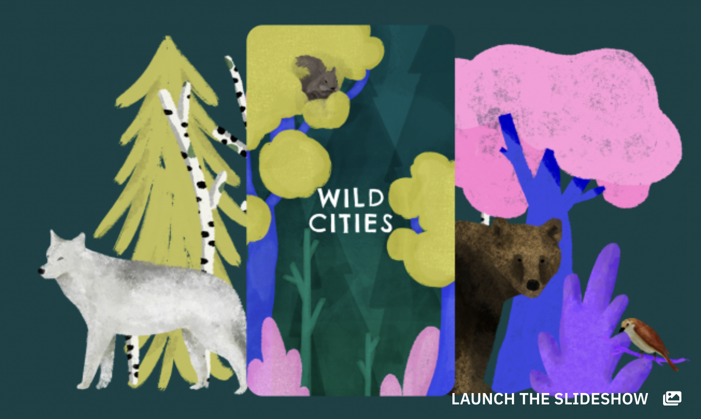
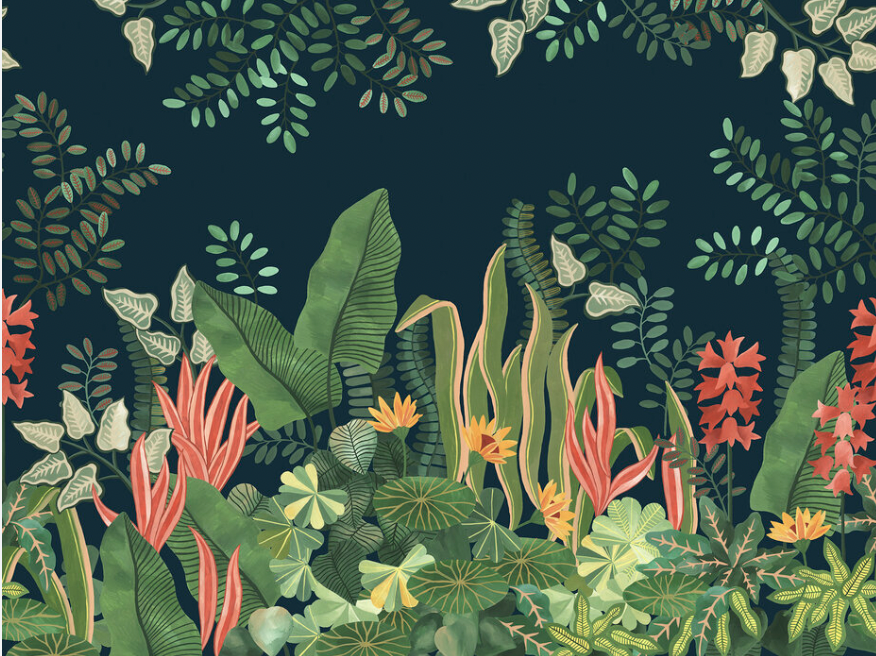

## Overall Design 
- Want the overall app to have this illustration style - 
- Put all the buttons with the dark green color, with white text. 

## All pages (global)
- Primary font is **Playfair Display** (Google Fonts, loaded via `next/font/google` as `Playfair_Display`). High-contrast editorial serif with a calligraphic italic — applied site-wide as the default `font-sans`.
- All pages use the dark green background (`#1a3a2a`) with the lush botanical SVG illustration.
- Font sizes on inner pages (identify, quiz, timeline) scaled up to match the homepage: page headings `text-3xl`, card titles `text-2xl`, body/label text `text-md`, button text `text-lg`.
- Primary buttons use dark green (`#1a3a2a`) with white text across all pages.
- Text sitting directly on the dark background is white; text inside white cards stays dark.

## sign up screen
- I want the background to be darkgreen, with very lush illustrations of nature around the sign up box. This is an image of lushness that I'm referring to . Make sure to use the illustration style that I put in from the overall design. 
- The name Treeban will be outside of the box above the sign of the box in white 

## Homepage
- Use the similar background as the sign up page (dark green + lush illustration)
- Remove the large 🌿 emoji hero circle. Replace with the app name "Treeban" as large display text, with the existing tagline below it.
- For the three buttons, keep the background white with black text. If the user hovers over any of the buttons, change the button background to green, and text/icon color to white. 
- For button "Quiz", The subtext should be "Remember your plant's names"
